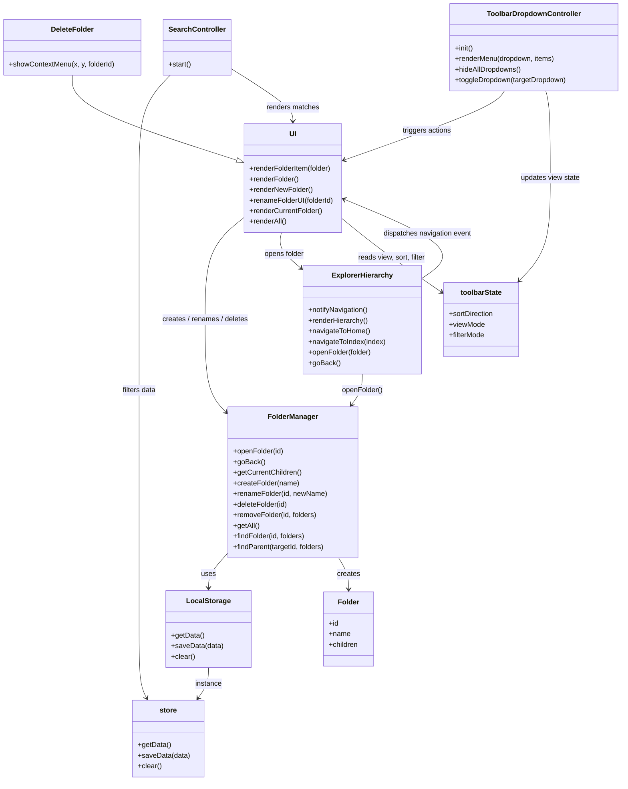

# UML Diagram

This diagram is based on the current JavaScript modules in the file explorer app.

## Class Diagram



## Main Flow

```mermaid
flowchart TD
    A[main.js] --> B[ui.renderCurrentFolder()]
    A --> C[searchController.start()]
    A --> D[action-bar-dropdowns.js init]

    E[User opens folder] --> F[ExplorerHierarchy.openFolder()]
    F --> G[FolderManager.openFolder(id)]
    F --> H[renderHierarchy()]
    F --> I[window dispatch explorer:navigate]
    I --> B

    J[User types in search] --> K[SearchController.start() input handler]
    K --> L[store.getData()]
    K --> M[ui.renderFolderItem()]

    N[User creates/renames/deletes folder] --> O[UI methods]
    O --> P[FolderManager create/rename/delete]
    P --> Q[store.saveData()]
    P --> B
```

## Notes

- `main.js` is the startup point.
- `ui.js` controls rendering and context-menu actions.
- `explorer-hierarchy.js` owns breadcrumb navigation and fires the `explorer:navigate` event.
- `folder.js` owns the folder tree, current folder state, and persistence via `store.js`.
- `search.js` renders filtered results directly into the content grid.
- `action-bar-dropdowns.js` changes `toolbarState` and re-renders the current folder view.